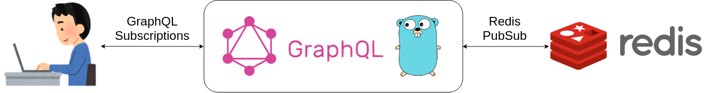

# Realtime Chat Server using GraphQL Subscriptions and Redis PubSub


## Abstruct
- This is the realtime chat server using **GraphQL Subscriptions**.
- GraphQL server is writtern in Golang.
- GraphQL server uses Redis PubSub in order to share messages on  multiple servers. 


## Explanation Entry
[GraphQL SubscriptionsとRedis PubSubを使ってリアルタイムチャットサーバーを作る](https://qiita.com/p1ass/items/462209fe73ece1238d85)

## Getting started
1. Run GraphQL server.
```bash
git clone https://github.com/p1ass/graphql-redis-realtime-chat.git
cd graphql-redis-realtime-chat
docker-compose up
```

2. Open `localhost:8080` and try GraphQL Playground.

3. You can also try it using a Nuxt.js client.
```bash
cd frontend
yarn
yarn dev
```
or
```
cd frontend
npm install
npm run dev
```

## Architecture



## References
- [Real-time Chat with GraphQL Subscriptions in Go](https://outcrawl.com/go-graphql-realtime-chat)
- [GoとRedisにおける簡単なチャットアプリケーション](https://medium.com/eureka-engineering/go-redis-application-28c8c793a652)
- [Redis の Pub/Sub を使って Node.js + WebSocket のスケールアウトを実現する方法](https://blog.dakatsuka.jp/2011/06/19/nodejs-redis-pubsub.html)
- [Apollo inside of NuxtJS](https://github.com/nuxt-community/apollo-module)
- [GraphQL と Nuxt.js でチャットを作る](https://www.aintek.xyz/posts/graphql-nuxt)